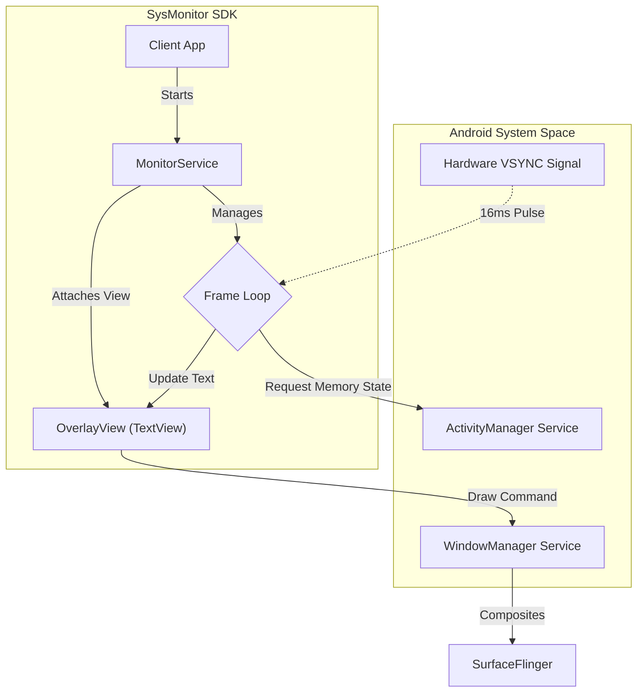
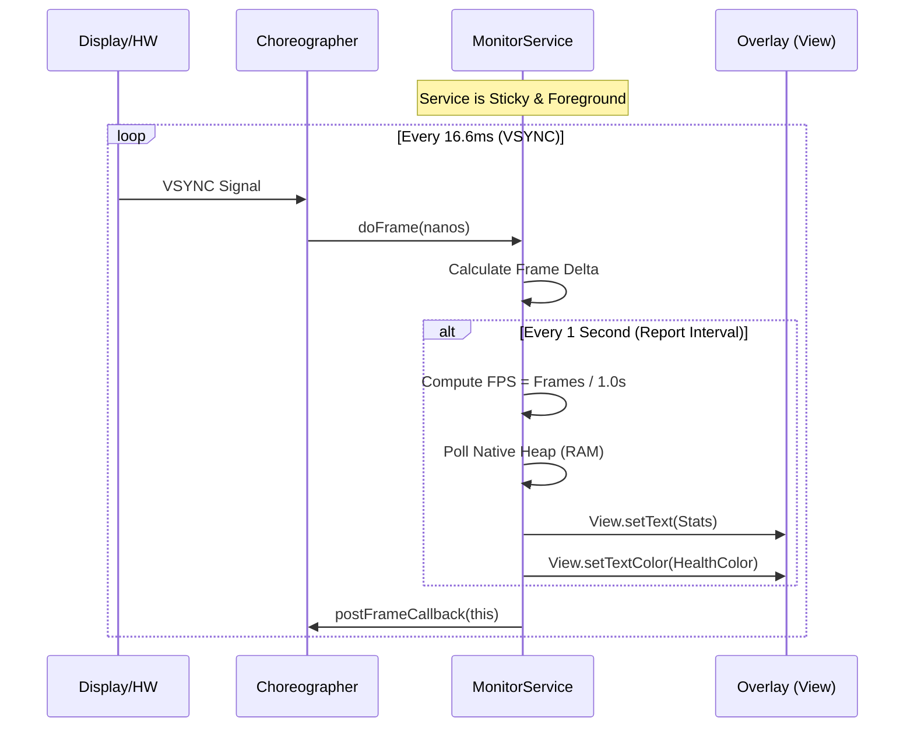
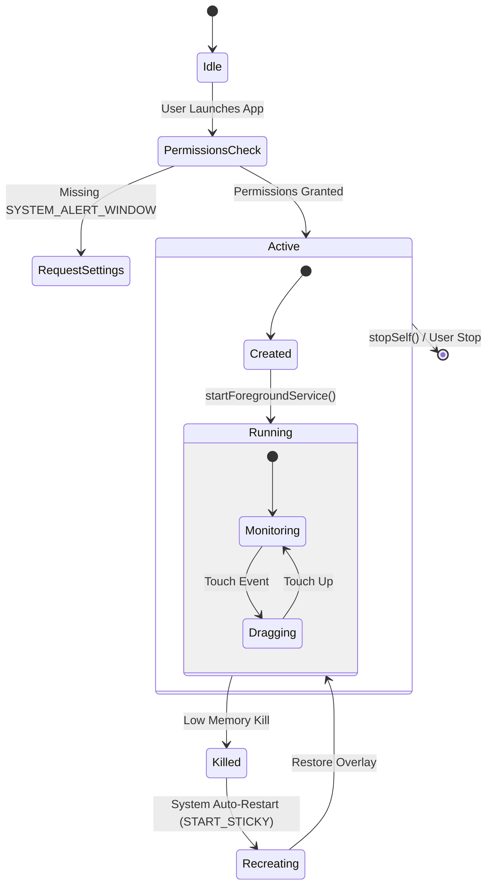
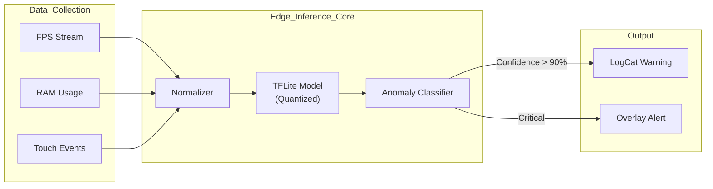

# SysMonitor SDK

[](https://developer.android.com)
[](https://kotlinlang.org)
[](LICENSE)
[]()

**SysMonitor** is a high-performance, low-overhead Android SDK designed to provide **real-time system profiling** directly on-device. Unlike traditional profilers that require a USB connection to Android Studio, SysMonitor lives in your production builds (debug/internal flavors), offering a persistent "Health Overlay" that tracks FPS, Memory usage, and system health while you use the app naturally.

> **Core Philosophy:** Observability should not come at the cost of performance. SysMonitor uses raw system callbacks and direct WindowManager integration to ensure negligible runtime overhead.

---

## System Architecture

SysMonitor bypasses the standard Activity-bound UI toolkit. Instead, it leverages a **Foreground Service** to project a lightweight `TYPE_APPLICATION_OVERLAY` view directly onto the global WindowManager canvas. This allows the profiler to persist across Activity changes, App restarts, and even Background events.

### 1. High-Level Component Graph

Only the most essential components are instantiated. The `MonitorService` acts as the central orchestrator, managing the lifecycle of the overlay and the data polling loop.



### 2. The Loop: Zero-Allocation Monitoring

To prevent the profiler from causing the very "jank" it seeks to measure, the monitoring loop avoids object allocation in the hot path. We hook into the `Choreographer`'s native VSYNC callback to measure frame timings with nanosecond precision.



---

## Lifecycle & Resilience

Since SysMonitor is often used in long-running testing sessions, resilience is key. The service is configured as `START_STICKY`, ensuring the Android OS attempts to restart it if the process is killed due to memory pressure.

### 3. Service Lifecycle State Machine



---

## 🔮 Future Scope: AI-Driven Observability

We are transitioning SysMonitor from a **Passive Reporter** to an **Active Analyst**. The next major version (v2.0) will introduce an edge-AI layer capable of correlating performance dips with specific user actions.

### Feature Roadmap

1.  **Black Box Recorder:**
    *   Utilize `AccessibilityService` to log user interactions (Clicks, Scrolls, Navigation) without instrumenting the codebase.
    *   **Goal:** Correlate a 15fps drop exactly with "User clicked 'Checkout'".

2.  **Edge Anomaly Detection (TFLite):**
    *   Train a lightweight regression model to learn the "Standard Performance Profile" of the app.
    *   Detect deviations (e.g., Memory Leaks) before `OutOfMemoryError` occurs.

### 4. Proposed AI Pipeline



---

## Tech Stack

| Component | Choice | Rationale |
| :--- | :--- | :--- |
| **Language** | Kotlin | Null-safety and modern syntax efficiency. |
| **UI Type** | Raw Views | Bypassing Compose/XML Layouts keeps the overlay extremely lightweight. |
| **Window Type** | `TYPE_APPLICATION_OVERLAY` | Draws over all other apps (except secure system dialogs). |
| **Concurrency** | `Choreographer` | The only accurate way to measure UI frame rendering vs Thread.sleep. |

---

## Installation

1.  **Clone the Repo**
    ```bash
    git clone git@github.com:current-user/SysMonitor.git
    cd SysMonitor
    ```

2.  **Build & Run**
    *   Open in Android Studio
    *   Select `app` run configuration
    *   Deploy to device (Emulator supported, Physical device recommended for accurate FPS)

3.  **Permissions**
    *   The app will automatically redirect you to **"Display over other apps"** settings on first launch.
    *   Grant the permission to see the overlay.

## Contribution

This project is open for internal improvements!
-   **Bug Reports**: Please open an issue with device model and Android version.
-   **Pull Requests**: PRs for optimization and UI polish are welcome.

---

*Verified on Android 14 (Moto G Play - 2024) & Android 12 (Emulator)*
